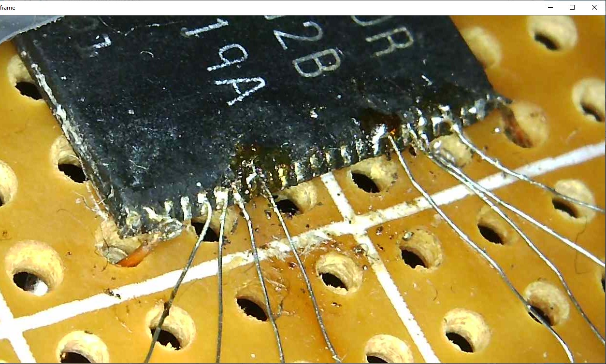
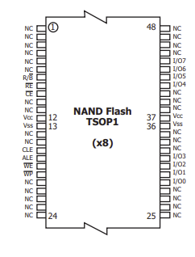

# Table of contents
- [Nand dumping on raspberry pi over smi](#nand-dumping-on-raspberry-pi-over-smi)
  * [Requirements](#requirements)
  * [My preperations](#my-preperations)
  * [Finding the information needed](#finding-the-information-needed)
  * [TODO instructions](#todo-instructions)
    + [Using nanddump](#using-nanddump)
    + [Understanding the dumped data](#understanding-the-dumped-data)

<small><i><a href='http://ecotrust-canada.github.io/markdown-toc/'>Table of contents generated with markdown-toc</a></i></small>


# Nand dumping on raspberry pi over smi

## Requirements

* kernels:
  * [raspberrypi-kernel_1.20210303-1](https://github.com/TheCrazyT/linux/tree/raspberrypi-kernel_1.20210303-1-nand) (linux-raspberrypi-kernel_1.20210303-1 ; 5.10.17-v7+)
  * [raspberrypi-kernel_1.20221104](https://github.com/TheCrazyT/linux/tree/raspberrypi-kernel_1.20221104-nand) (linux-raspberrypi-kernel_1.20221104 ; 5.15.76-v7+)
    * [zImage](https://filedn.eu/lYSpEcvitT17eGF7Dm10Igh/raspberrypi-kernel_1.20221104-nand/zImage) for "Raspberry Pi OS" bullseye 32-bit
* 8-bit nand-chip (in my case: [HY27UF084G2B](https://docs.rs-online.com/9e99/0900766b80d6fc8b.pdf)) + datasheet
  * a 16-bit nand-chip will need a lot more pins, beside the soldering problems you probably need a bi-directional multiplexer!
    this increases complexity and I'm not shure if the bcm2835_smi_nand-driver can handle that (but I guess those nand-chips are more common nowadays)
* datasheet of the chip/flashcontroller (in my case: [SiRFatlasV](https://web.archive.org/web/20210923154401/https://gps.0xdc.ru/static/sirf/doc/SirfAtlas/CS-130805-DS%20SiRFatlasV%20Datasheet.pdf) - flashcontroller was integrated inside the chip)
   * actually only the info about the structure of OOB is needed (page 305 of mentioned document)

## My preperations

I decided to take a nand-dump of my old navigation system "A-Rival NAV-PNU43".

The gps-system was not booting anyway so I just decided to see if it is possible to take a closer look at the contents of the nand itself.

During the process of desoldering I failed and have broken alot of pins.

In rage i decided to cut the other pins as well but decided luckyly to keep the nand chip just in case.

A lot of months later I was thinking if it is possible to still access the pins by removing some of the protection layer on top.

I decided to remove that black layer with sandpaper which worked as expected.

The soldering itself was really complicated because of the pitch, avoiding solder bridges was really a pain.



(ignore the copper wires on the edges, just needed them to hold the chip in place)

During the process i created alot of solder bridges that needed to be removed again.

The good thing about the nand-chip was that it was 8-bit only. (that means less pins to solder)

Since Vcc and Vss were redundant (and because I was lazy) I decided to only solder those on the left side of the chip.

Not shure if it has any effect if they are not connected on the right side, but probing those pins showed that there is nothing "between", so it should not matter.

Some of the pins still had solder bridges but according to the datasheet they only bridged to NC-pins, so this does not have any effect.

It took me several hours to get this right (but maybe won't need that long with better equipment).


## Finding the information needed

During my search i came across the following [information](https://iosoft.blog/2020/07/16/raspberry-pi-smi/).

Especially the images: 




helped me to figure out what needs to be connected to what pins of the chip.

TODO: 
* explain missing information in rpi_smi_pinout.png about SA0 and SA1 (SMI_NAND_CLE_PIN and SMI_NAND_ALE_PIN) by the source of bcm2835_smi_nand.c
* need a proper pinout-mapping picture

The reason I added kernel version information to this page is because the smi-support for nand-chips was [dropped](https://github.com/raspberrypi/linux/commit/72ce5a4330588174a0e138c1a87626bf16217020) in later kernels.

Sad thing is that you won't even notice it, you can only test it by running the following commands:

```
sudo dtoverlay smi-nand
#redundant, but displays error if missing
sudo modprobe bcm2835_smi_nand
```

## TODO instructions
* talking about oob/ecc/bch, images and stuff:
    * run build_and_install_misc.sh and build_and_install_raw_nand.sh
    * run sudo dtoverlay smi-nand
    * talking about random readid issues
    * talking about using readid to figure out which pin is connected incorrectly (-> resolder)
    * talking about data to figure out which pin is connected incorrectly (-> resolder)
    * talking about still existing byte-shift problem
    * talking about figuring out the ecc-algo used
    * first try with [python-bchlib] (https://github.com/jkent/python-bchlib)
    * problems/bugs ... bitswap -> writing raw c-programm by using kernel files ([bch.c](https://github.com/raspberrypi/linux/blob/rpi-5.10.y/lib/bch.c), [bch.h](https://github.com/raspberrypi/linux/blob/rpi-5.10.y/include/linux/bch.h))

### Using nanddump

Before using it you need to install it with:

```
sudo apt-get install mtd-utils
```

Because most nand-chip-data have a custom layout, you need to dump with outofband-data and "dumpbad".

```
sudo nanddump -o -n --length=536870912 --bb dumpbad -f nand_oob /dev/mtd0
```

(Note: in my case it was a 512MB-nand ... so ``536870912=512*1024*1024``)

Later you would need to remove the out of band data (and optionally check the ecc against the data).

If you use no out-of-band-data the current system would assume that it has a default-layout and will incorrectly check the [ecc](https://en.wikipedia.org/wiki/Error_correction_code).

The reason for this is that it assumes the ecc to be at a default location (and I could assure you it won't be at that location, atleast not on random nand-chips of other devices).

This means you will get lots of [error messages](https://filedn.eu/lYSpEcvitT17eGF7Dm10Igh/raspberrypi-kernel_1.20221104-nand/dmesg.txt) on ``dmesg`` telling you that the block is incorrect/damages(although in most times it isn't).

The layout itself is actually defined by the flashcontroller.(or could be defined by the system itself)

### Understanding the dumped data

Example layout of first block (hexadecimal representation, [binary of first block](block1.bin)):
  
[2048 bytes of data]

FF 00 00 00 00 FC FF FF **E8 9E A9 00 B6 92 49 22**

**C2 55 19 50 ED 69 14 A9 2B DB BE F6 5B 24 98 34**

**7F** # **C3 4F A2 0F 34 CE 8D 8C A6 55 00 94 7C 88 B8**

**3A D7 09 ED EF FC** 00 00 FF FF FF FF FF FF FF FF

The 2 bold marked texts are 2 ECC-sections (using [bch](https://en.wikipedia.org/wiki/BCH_code) encoding).

The first refers to the first 1024 of data and the 2nd for the next 1024 of data.

Also take a look at page 305 of [SiRFatlasV-Datasheet](https://web.archive.org/web/20210923154401/https://gps.0xdc.ru/static/sirf/doc/SirfAtlas/CS-130805-DS%20SiRFatlasV%20Datasheet.pdf) (Section "ECC Data in NAND Format" - "Figure 61: 2048+64 Bytes/Page with 12-bit BCH ECC Data Format").

It helps to understand why those are BCH-ECC.

It is important to understand that the layout is different for every embedded device!

So understanding the right layout is important ... a datasheet helps alot.

Of course you could also try to "guess" the layout, but thats probably much harder.

(although it might not be impossible with the right blocks of data, like only zeros)

The location of the out-of-band-data section (or OOB) is defined by the nand-chip-type itself.

If you take a look at the [Datasheet](https://docs.rs-online.com/9e99/0900766b80d6fc8b.pdf) of the nand-chip you might see the information "2K + 64 spare".

That basically means each block has 2048 bytes of data and 64 out-of-band-data.

So if you dump with "nand_oob" you have oob-data in between that you can use to correct the actual data.

If you just do not care about error correction, you could just strip the oob-data from within that dump.

That would be possible by a script that reads 2048 bytes of data, skips the next 64 byte, reads the next 2048 bytes of data and so on ... (keep in mind that 2048 might be a different number for your nand-chip - if you are too lazy, maybe [this script](https://github.com/Hitsxx/NandTool/blob/master/Nand-dump-tool.py) will help with that)

Incase you just do not know the method used for error correction you could also just dump multiple times and compare those dumps to find the errors.  ( [this script](https://github.com/Hitsxx/NandTool/blob/master/firmware-reconstruct.py) might be useful )

